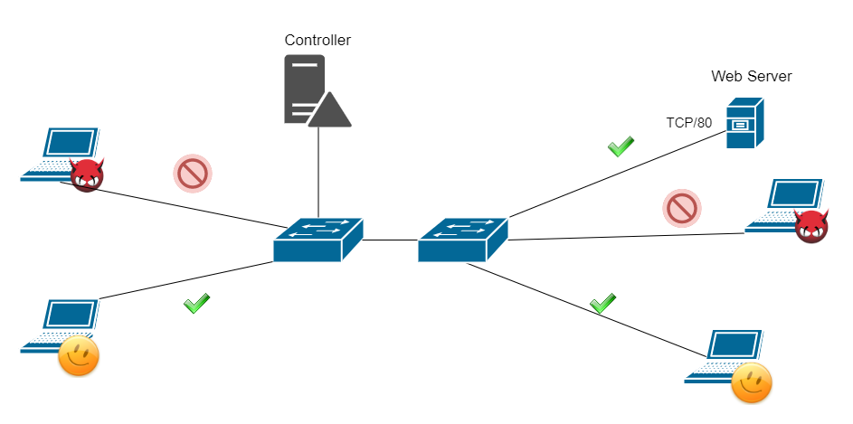
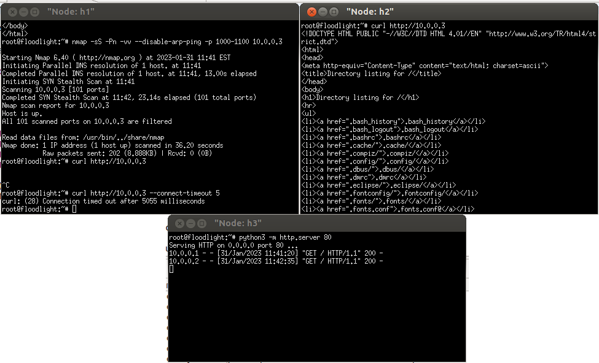

# Reaktywny firewall
### Łukasz Kowalczyk, Łukasz Oszczypała, Marcin Świstak, Piotr Śladowski

---
<style scoped>section { justify-content: start; }</style>
# Wprowadzenie teoretyczne

Celem naszego projektu było opracowanie algorytmu który pozwoliłby na filtracje packietów bazując na ich nagłówkach (ang. headers). Projekt był realizowany z wykorzystaniem takich technologii jak język programowania Java, OpenFlow oraz programu Mininet. Naszą wiedzę czerpaliśmy ze źródeł takich jak : materiały przygotowawcze do laboratorium z przedmiotu Sieci Sterowane Programowo, dokumentacji Mininet, licznych forów internetowych oraz publicznie dostępnych repozytoriów Github (Opensource Code).

---
<style scoped>section { justify-content: start; }</style>
# Topologia 

Główny element sieci jest rzecz jasna programowalny przełącznik korzystający z protokołu OpenFlow , który jest fundamentem naszego projektu. Przełącznik programowalny został stworzony przez firme Floodlight.Wybraliśmy ten przełącznik poniewaz jest to jeden z najbardziej rozpowszechnionych przełączników , oraz cechuje się duza społecznośnią przez co rowniez dostepna jest duza liczba przykładowych podstawowych rozwiązań opartych na jego wykorzystaniu(np DNS, LoadBalancer, itp)

---
<style scoped>section { justify-content: start; }</style>
# Topologia  c.d.

Oprócz programowalnego przełącznika zdecydowalismy sie na wykorzystanie czterech hostów, których podzieliliśmy na podgrupy: hosty uprawnione do odczytywania danych z serwera oraz hosty, które chcą dokonać skanowania tego serwera. Komunikacja odbywa się za pomocą protokołu TCP. Serwer sieciowy nasluchuje na porcie 80.



---
<style scoped>section { justify-content: start; }</style>
# Opis algorytmu 

Naszym głównym zamysłem podczas tworzenia projektu było stworzenie takiego algorytmu, który to będzie sprawdzał, czy dane hosty (rozrózniane poprzez źródłowe adresy IP) nie nazbyt często dokonują odpytania serwera sieciowego na porcie 80. Po odpytaniu serwera pewna liczbe razy przez nieupowaznionego hosta to wysylane wiadomosci z tego adresu źrodlowego zostana zablokowane przez kontroler.  


---
<style scoped>section { justify-content: start; }</style>
# Opis kodu 

Nasz kod głównie opiera sie na metodzie recieve, w której to przechwytujemy payload pakietu, nastepnie wyłuskujemy dane na temat adresy źrodłowego, adresu docelowego, portu docelowego. Nastepnie szereg if-ów posłużył nam do odpowiedniego odfiltrowania pakietów oraz do ograniczenia dostepów dla niepuprawnionych hostów. 

--- 
<style scoped>section { justify-content: start; }</style>
# Filtracja payloadu 

```java
if (eth.getEtherType() == EthType.IPv4) {
	IPv4 ipv4 = (IPv4) eth.getPayload();
	if (ipv4.getProtocol() == IpProtocol.TCP) {
		TCP tcp = (TCP) ipv4.getPayload();
		String src_ip = ipv4.getSourceAddress().toString();
		String dst_ip = ipv4.getDestinationAddress().toString();
		int dst_port = tcp.getDestinationPort().getPort();

```
---
<style scoped>section { justify-content: start; }</style>
# Sprawdzenie czy port należy do zbioru portów zagrożonych
```java

if (maliciousPort(dst_port)){
	impostorScore.put(src_ip, impostorScore.get(src_ip) + 1);
}
if (impostorLast10Ports.get(src_ip).size() == 10){
	List<Integer> newPortsList = impostorLast10Ports.get(src_ip).subList(1, 10);
	newPortsList.add(dst_port);
	impostorLast10Ports.put(src_ip,newPortsList);
	List<String> newIPsList = impostorLast10DestIps.get(src_ip).subList(1, 10);
	newIPsList.add(dst_ip);
	impostorLast10Ports.put(src_ip,newIPsList);
	
	HashSet<Integer> set_port = new HashSet<>(impostorLast10Ports.get(src_ip));
	HashSet<Integer> set_ip = new HashSet<>(impostorLast10DestIps.get(src_ip));
```

---
<style scoped>section { justify-content: start; }</style>

# Uruchmania scenariusza testowego

### Uruchomienie serwera HTTP
```shell
python3 -m http.server 80
```

### Uruchomienie nmapa - skanowanie portów
```
nmap -sS -Pn -vv --min-rate=40 --disable-arp-ping -p 1000-1100 10.0.0.2
```

### Uruchomienie nmapa - skanowanie różnych ip
```
nmap -sS -Pn -vv --min-rate=40 --disable-arp-ping -p 80 10.0.0.0/24
```


---

<style scoped>section { justify-content: start; }</style>

## Rozpoznawanie prób wykorzystania niepopularnych portów

```java
private boolean maliciousPort(int dst_port) {
	int knownPorts[] ={ 80, 23, 443, 21, 22, 25, 3389, 110, 445, 139, 143, 53, 135, 3306, 8080, 1723, 111 };
	if (Arrays.asList(knownPorts).contains(dst_port))
			return false;
	return true;
}
```

---



---
# Dziękujemy za uwagę 

---

### Zestawienie topologii
```
mn --topo single,4
```
